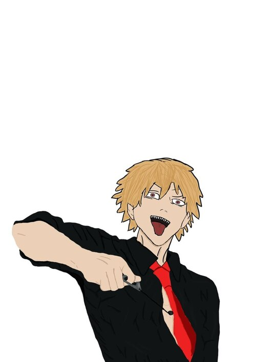

<div align="center">
  
  
  # `> Hello World.exe` | I'm Artyom

  [](https://git.io/typing-svg)
</div>

<br>

## `> SYS.INFO` - About Me 👨‍💻

```csharp
// Developer initialization...
Developer developer = new Developer
{
    Name        = "Artyom",
    Age         = 16,
    Location    = "Russia",
    MainStack   = "C#",
    SecondStack = new[] { "C++", "Assembler NASM" },
    Passions    = new[] { "Programming", "Anime Art", "Reverse Engineering" },
    Status      = "Looking for interesting projects",
    Workplace   = "Home"
};
```

<div align="center">
  
</div>

> `> echo "Code is a tool that brings ideas to life. Welcome!"`

<br>

## `> SKILL.EXE` - Skills and Tools 🛠️

<div align="center">
  
  ### `> LANGUAGES.dll`
  
  
  

  ### `> IDE & EDITORS.app`
  
  

  ### `> ENGINEERING.exe`
  
  
  

  ### `> GRAPHICS.art`
  
  
  
</div>

<br>

## `> HACK.log` - Reverse Engineering Experience 💻

<div align="center">
  <table>
    <tr>
      <td>
        <h3>🔍 TOOLS</h3>
        <ul>
          <li>Cheat Engine</li>
          <li>IDA Pro</li>
          <li>memory.dll</li>
        </ul>
      </td>
      <td>
        <h3>🎮 HACKED GAMES</h3>
        <ul>
          <li>RimWorld</li>
          <li>Watch Dogs Legion</li>
          <li>Far Cry 6</li>
          <li>Satisfactory</li>
        </ul>
      </td>
      <td>
        <h3>🧪 DEVELOPMENTS</h3>
        <ul>
          <li>Assembly scripts</li>
          <li>C# trainers</li>
          <li>IDA Pro analysis</li>
        </ul>
      </td>
    </tr>
  </table>
</div>

<details>
  <summary><b>🔐 More about hacking...</b></summary>
  <ul>
    <li>✅ Adding infinite resources</li>
    <li>✅ Flight mode</li>
    <li>✅ Game mechanics modification</li>
  </ul>
</details>

<br>

## `> ART.draw` - Creativity 🎨

<div align="center">
<p style="font-weight: bold; font-size: 18px; color: #ff6347;">Best art so far (referenced work)</p>
  
</div>

<div align="center">
  <details>
    <summary><b>🖌️ MY JOURNEY IN ANIME ART</b></summary>
    <br>
    <ul>
      <li>🔸 Learning to draw for 3 months</li>
      <li>🔸 Main tool: Clip Studio Paint</li>
      <li>🔸 Additionally use Photoshop for processing</li>
      <li>🔸 Practice character sketches and backgrounds</li>
    </ul>
  </details>
</div>

<br>

## `> PROJECT.run` - Current Project: NorthMine.ru 🚀

<div align="center">
</div>

<div align="center">
  <details>
    <summary><b>📊 PROJECT PROGRESS</b></summary>
    <br>
    <p>
      <b>Server-side:</b>
      
    </p>
    <p>
      <b>Web interface:</b>
      
    </p>
    <p>
      <b>Optimization:</b>
      
    </p>
  </details>
</div>

Developing **NorthMine.ru** — a Minecraft server where I work as the technical developer. The project is in active development.

**Goals:**
```
[✓] Create a functional and reliable Minecraft game server
[✓] Implement innovative gameplay mechanics
```

<br>

## `> WORK.env` - Work Environment 🏠

<div align="center">
  <table>
    <tr>
      <td align="center" width="100"><b>🏡</b></td>
      <td>Working from home, which allows me to focus on projects in a comfortable environment</td>
    </tr>
    <tr>
      <td align="center"><b>⚙️</b></td>
      <td>Configured development environment: Visual Studio + VS Code for programming</td>
    </tr>
    <tr>
      <td align="center"><b>🎨</b></td>
      <td>Separate setup for creativity: Clip Studio Paint + Photoshop</td>
    </tr>
  </table>
</div>

<br>

## `> ABOUT.me` - Interesting Facts 🎯

<div align="center">
  <table>
    <tr>
      <td align="center"><b>🎵</b></td>
      <td>I love cyberpunk, Japanese atmosphere, and music while working</td>
    </tr>
    <tr>
      <td align="center"><b>🚀</b></td>
      <td>My goal is to create a project that will attract people's attention</td>
    </tr>
    <tr>
      <td align="center"><b>🎌</b></td>
      <td>I'm fascinated by Japanese culture and anime, which is reflected in my creative work</td>
    </tr>
  </table>
</div>

<br>

## `> CONTACT.now` - Connect With Me 📫

<div align="center">
  <a href="https://discord.com/users/zazaryxs">
    
  </a>
  <a href="https://t.me/ZazaryXS">
    
  </a>
  <a href="mailto:zazaryxs@gmail.com">
    
  </a>
</div>

<div align="center">
  
  
  <h3>
    <pre>CONNECTION_ESTABLISHED: Thank you for visiting my profile!</pre>
  </h3>

  
</div>